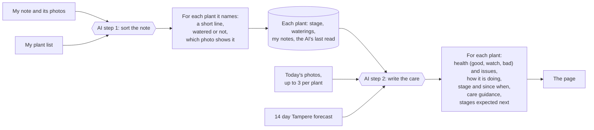

# Dara's Balcony Garden

A personal journal and care assistant for my home garden. It combines my plant photos, logs and the local weather with AI to forecast what each plant needs and give timely care guidance.

**Live:** https://balcony-garden.dara-uxdesign.workers.dev

A personal tool, customized for my needs. I write short notes and take photos of my plants, on the glazed balcony and indoors. An AI reads them together with the Tampere forecast and writes care guidance for every plant: how it is doing, how to water and feed it right now, what to watch for. The notes and photos stay as a growth record.

## What it does

- **Journal.** I write notes and add photos. Typing `@` tags plants; a note without tags is sorted onto plants by the AI. After saving, the page shows what changed for each plant.
- **Care guidance.** For every plant the AI writes how it is doing and what to do now. It updates after every note and once a night.
- **Season bar.** Each plant's year from sowing to harvest. Recorded stages are solid, expected ones hatched.
- **Watering.** A droplet button on each plant logs when I last watered it.
- **Weather.** The Tampere forecast, with an alert on cold nights and hot days, for the balcony plants only.
- **Photos.** The newest photo sits on each plant's card, and a plant's page keeps all of them.
- **Plant pages.** `/p/<plant-id>` has the full season, care, photos, journal and notes on the variety.
- Light and dark theme, and a 3D view of the balcony at `/3d`.

## What happens when I save a note

1. The note is saved straight away, exactly as I typed it.
2. It is put onto plants: by its `@` tags if it has any, otherwise by the AI. With several tags and some photos, the AI only decides which tagged plant each photo shows.
3. The AI then reads every plant's status and notes, today's photos and the 14-day forecast, and rewrites the health read, stage and care guidance for every plant.
4. The page picks up the result and shows what changed.

When the AI has not run yet, or a call failed, the plant says so plainly. There is no made-up fallback advice.

## What the AI reads and writes

There are two AI steps. The first only runs for a note without `@` tags (or to sort photos between several tagged plants). The second runs after every note and once a night.

## How it is built

- **Page:** one static page, [`public/index.html`](public/index.html), with plain HTML, CSS and JavaScript. No framework and no build step.
- **Shared logic:** [`public/garden-view.js`](public/garden-view.js) (season spans, the journal, `@` tags, photo order) and [`public/care-rules.js`](public/care-rules.js) (weather alerts, health labels). The page and the tests both load them.
- **Plant list:** [`public/garden-data.js`](public/garden-data.js).
- **Server:** a Cloudflare Worker, [`src/index.js`](src/index.js), serves the page and a small API. Everything is stored in one KV namespace.
- **AI:** Gemini (`gemini-flash-latest`, free tier) through the `GEMINI_API_KEY` secret. [`src/distill.js`](src/distill.js) sorts notes onto plants and [`src/planner.js`](src/planner.js) writes the guidance. On the free tier Google may use the notes and photos to improve its models, which is fine for a balcony garden.
- **Weather:** the Open-Meteo forecast, no key needed.

Stored data:

- `status:garden`: each plant's stage, last watering, notes, health read and dated stage history. This is the record of what is true about a plant right now.
- `care:garden`: the AI's latest guidance and the stages it expects next. Only the AI step writes it.
- `entries:garden`: my notes exactly as typed, and which plants each one was put onto.
- `photo:<id>`: each photo, with its date and plant.

## API

Reads are open. Writes need `Authorization: Bearer <UPLOAD_PASS>`.

| Endpoint | Method | What it does |
|---|---|---|
| `/api/entries` | `GET`, `POST` | My notes as typed. `POST` saves one. With `plantIds` (and the `mentions` as typed) it goes straight onto those plants; without, the AI sorts it. |
| `/api/entries/:id` | `PATCH`, `DELETE` | Put a note onto plants by hand (`{plantIds}`), reword it, or delete it. |
| `/api/status` | `GET` | Every plant's stage, last watering, notes, health and stage history. |
| `/api/status/:id` | `PUT` | Change one plant's fields (`{stage}`, `{lastWatered}`). |
| `/api/notes` | `POST` | Add, edit or delete a single note on a plant. |
| `/api/care` | `GET` | The latest care guidance. |
| `/api/photos` | `GET`, `POST` | List photos, or upload one (`date`, `plant` in the query). |
| `/api/photos/:id` | `GET`, `PATCH`, `DELETE` | Get one photo, change its plant, or delete it. |
| `/api/cover` | `GET`, `PUT` | The garden cover photo. |

Every write that changes a plant starts a new guidance run in the background, so the response never waits for the AI. A nightly run at 03:00 UTC (`triggers.crons` in [`wrangler.jsonc`](wrangler.jsonc)) keeps the guidance current on quiet days.

## Editing the plant list

Plants live in [`public/garden-data.js`](public/garden-data.js).

- After editing a plant (stage, area, note), bump the `version` number so the change is picked up on the next load.
- `area` is `"balcony"` (glazed, gets the forecast) or `"indoor"` (heated room, does not). Moving a plant indoors for winter is an edit here plus a version bump.
- `water:'YYYY-MM-DD'` records a watering on that date.

A new plant keeps the variety's default season until it actually changes stage.

## Passphrase

Reading is open to anyone with the link. Changing anything (notes, waterings, stages, photos, the cover) needs the passphrase (`UPLOAD_PASS`). The page asks for it once per device. The Gemini key is a separate secret that only the Worker sees.

## Running it locally

- `npx wrangler dev` runs the whole site locally with its own local data, so I can try changes without touching the live garden. The secrets go in `.dev.vars`.
- `npm test` runs the tests for the shared logic, the stores, the AI parsing and merging, and the 3D scene.
- `npx wrangler deploy` publishes it.
